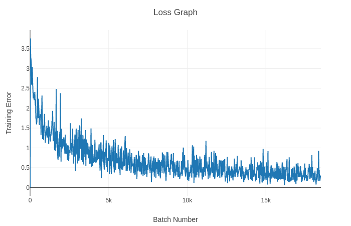

# PointNet in PyTorch

This is a PyTorch re-implementation of PointNet according to the specifications laid out in the paper with two minor differences:

 * I exclude the adaptive batch normalization decay rate
 * The trained model provided operates on pointclouds with 2000 points as opposed to 2048 (although you can re-train and change the pointcloud sizes)

### Other Implementations
 * The official TensorFlow implementation can be found [here](https://github.com/charlesq34/pointnet).
 * Another PyTorch re-implementation can be found [here](https://github.com/fxia22/pointnet.pytorch).

If you use my re-implementation for your own work, please cite the original paper:

```
Qi, Charles R., et al. "Pointnet: Deep learning on point sets for 3d classification and segmentation." 
Proc. Computer Vision and Pattern Recognition (CVPR), IEEE 1.2 (2017): 4.
```

## TO-DO's
 * Finsh segmentation implementation
 * Upload the sampled ModelNet40 data


## Classification Results

The pre-trained classifier model included in this repository was trained for 60 epochs with a batch size of 32 on a 2000-point-per-model sampling of ModelNet40.

Here is an graph showing the training loss over 60 epochs:




Total Accuracy: 0.852917

| Dresser | Chair | Piano | Keyboard | Tent | Wardrobe | Bookshelf | Bed |
| 0.76 | 0.95 |0.83 | 0.90 | 1.00 | 0.65 | 0.95 | 0.92 |
| XBox | Vase | Table | Flower Pot | Cup | Glass Box | Night Stand | Sink|
| 0.70 | 0.81 |0.70 | 0.00 | 0.45 | 0.89 | 0.66 | 0.65 |
| Laptop | Airplane | Curtain | Range Hood | Stairs | Door | Radio | Bowl|
| 0.95 | 0.99 |0.80 | 0.91 | 0.65 | 0.85 | 0.70 | 1.00 |


-toilet: 0.880000
-plant: 0.890000
-monitor: 0.940000
-lamp: 0.750000
-mantel: 0.890000
-tv_stand: 0.790000
-car: 0.910000
-cone: 0.850000
-bathtub: 0.820000
-bottle: 0.960000
-person: 0.850000
-stool: 0.600000
-bench: 0.850000
-guitar: 0.910000
-sofa: 0.970000
-desk: 0.802326

